<a href="https://jw3b.dev"></a>

<p align="center">
  <a href="https://jw3b.dev"><b>jw3b.dev</b></a> · <a href="https://jw3b.dev/hire-me">./hire-me</a> · <a href="https://jw3b.dev/audit">./audit</a> · <a href="https://jw3b.dev/ctf">./ctf</a> · <a href="https://jw3b.dev/work">./work</a> · <a href="https://jw3b-dev.github.io/">profile site</a>
</p>

```text
~❯ cat about.md
John Wellard (Johno) · JW3B / AgileGypsy · UK
Senior Agentic AI Developer & Smart-Contract Auditor · founder, AgileGypsy Labs
```

**A portfolio you can operate, not just read.** [jw3b.dev](https://jw3b.dev) hands you the controls: edit a contract in the hero console and watch the auditor re-run, paste Solidity for a heuristic screen plus an AI narrative, drain a live reentrancy vault on Base Sepolia and prove it on-chain, or talk to a concierge grounded in a verified evidence register, by text or hands-free voice transcribed on-device.

- **Ships agentic AI end-to-end.** Multi-agent pipelines, graph retrieval, edge RAG, delivered as running products with paying users, not slideware.
- **Audits smart contracts autonomously**, backed by a competitive audit record. The product is [KTHULHU](https://kthulhu.co).
- **Delivers long-horizon work across borders.** Scope it, size it honestly, name the risks.

---

## 🦅 Audit Record

Every number on jw3b.dev routes through an evidence register with a source pointer; the build fails if unsourced copy appears. The citable record:

| Platform | Placement | Findings | Points |
|---|---|---|---|
| [CodeHawks](https://codehawks.cyfrin.io) | **#124** | **17** findings, **8 High** | **1,430 EXP** |

Sample findings: critical unauthorized withdrawal in `withdrawAllFailedCredits()`, reentrancy in `claimFaucetTokens`, deposit slips accepting investor funds without minting shares, battle-arena DoS via NFT token injection, pseudo-randomness in `go_on_stage_or_battle()`. No "TVL secured" figures, because they cannot be evidenced. Also hunting on Immunefi: protocol invariants and fuzzing.

---

## 🧪 Labs

| Lab | What it is |
|---|---|
| **KTHULHU** | AI-powered smart-contract security as a service, continuous protection with a competitive record behind it. [kthulhu.co](https://kthulhu.co) |
| **Director OS** | Deterministic fly-by-wire orchestration for autonomous software engineering: an 845-task DAG on Cloudflare Durable Objects, an MCP bridge of 13 typed tools, headless PTY daemons, cross-session RAG, automated Git worktrees. |
| **Nano-Bot-Trader** | High-frequency trading infrastructure scaling a 15-strategy MEV matrix across ephemeral GCP VMs and Durable Objects; three-tier AI orchestration, air-gapped under a strict "never hold keys" principle. |
| **Kointel** | Edge-native crypto tax engine for South African SARS compliance and CARF: Next.js 15, Workers and D1, capital-vs-revenue classification, ZAR FIFO lot matching, POPIA-compliant encryption. |

---

## 💼 Repositories

| Repository | What it is |
|---|---|
| [jw3b.dev_portfolio_website](https://github.com/jw3b-dev/jw3b.dev_portfolio_website) | The operable portfolio: React 19, Cloudflare Workers, Claude, Foundry. Built and gated by a multi-agent pipeline whose engineering record is in the repo. |
| [solidity-audits](https://github.com/jw3b-dev/solidity-audits) | Audit reports, competitive findings, invariant testing suites. |
| [development_agent](https://github.com/jw3b-dev/development_agent) | The Agentic Web3 Development Platform. |
| [crosshair15-cooling](https://jw3b-dev.github.io/crosshair15-cooling/) | Cooling mod guide and Linux thermal tooling for an MSI Crosshair 15, researched and instrumented. |
| [dualweb-dashboard](https://github.com/jw3b-dev/dualweb-dashboard) | Seamless navigation between Web2 and Web3 worlds. |
| [cyfrin-updraft-track](https://github.com/jw3b-dev/cyfrin-updraft-track) | Structured progress through the Cyfrin Updraft curriculum. |

---

## 🛠️ Stack

```text
agents      Claude · multi-agent pipelines · graph retrieval · edge RAG · MCP · local LLMs (Ollama)
web         TypeScript · React 19 · Next.js · Vite · Tailwind · Cloudflare Workers, Durable Objects, D1, KV, R2, Workers AI · GCP
chain       Solidity · Yul · Foundry · Hardhat · ethers / viem / wagmi · Uniswap v2/v3 · Curve · Base · XMTP
voice       Whisper on WebGPU → WASM → server, disclosed when it switches
security    competitive audits · invariant fuzzing · deterministic heuristics · claims gating · secret scanning
```

## 📚 Certifications

SSCD+ (Cyfrin Updraft Solidity Smart Contract Developer) · Smart Contract Security (Cyfrin) · Advanced Foundry (Cyfrin) · Advanced Web3 Wallet Security (Cyfrin) · [Neo4j Certified Professional](https://graphacademy.neo4j.com/c/e235aec4-a1e6-4bab-ad1b-2777f199d60c/)

## 📢 Connect

| Channel | Where |
|---|---|
| Hire | [jw3b.dev/hire-me](https://jw3b.dev/hire-me) |
| LinkedIn | [linkedin.com/in/john-wellard](https://www.linkedin.com/in/john-wellard/) |
| Email | onchain@jw3b.dev |
| X | [@AgileGypsy_](https://x.com/AgileGypsy_) |
| Payments | [Airtm](https://airtm.me/agilegypsy_) · [UD.me wallet](https://ud.me/jw3b.brave) |

<p align="center"><code>~❯ JW3B._</code> &nbsp; <code>// STAY WEIRD 👽</code></p>

<sub>Brand assets (the JW3B. mark, prompt treatment, banner and tagline) © 2026 John Wellard, all rights reserved. See <a href="https://github.com/jw3b-dev/jw3b-dev.github.io/blob/main/brand/LICENSE-BRAND.md">LICENSE-BRAND</a>.</sub>
